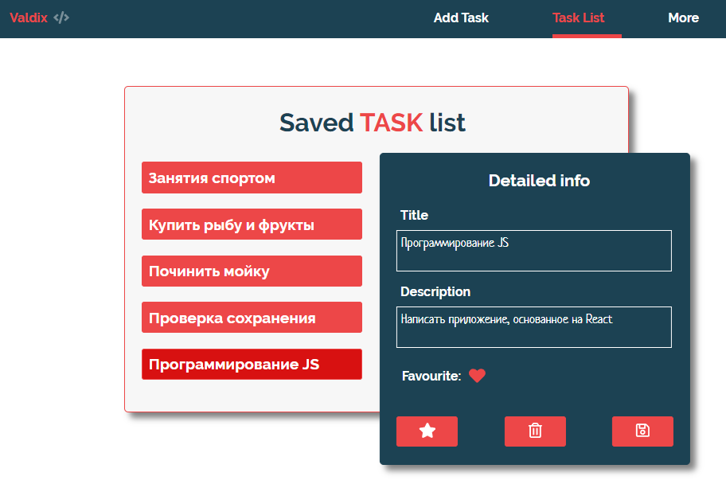

Использует **React**, **Firestore**. 
Реализует запросы по принципу **CRUD**. 
Валидация **PropTypes**. 
Стилизация **Sass**. 

Реализует функционал записной книжки. 
Завершенный проект.

-----

- [Маршрутизация](#Маршрутизация)
- [Препроцессор Sass](#Препроцессор-Sass)
- [Подключаем fontAwesomeIcon](#Подключаем-fontAwesomeIcon)
- [Подключаем Firestore](#Подключаем-Firestore)
  - [Добавление данных](#Добавление-данных)
  - [Извлечение данных](#Извлечение-данных)
  - [Обновление удаление данных](#Обновление-удаление-данных)
- [Базовые настройки](#Базовые-настройки)
- [Паттерны и лайфхаки](#Паттерны-и-лайфхаки)
  - [Таймер для изменения стейта](#Таймер-для-изменения-стейта)
  - [Массив примитивов в объект](#Массив-примитивов-в-объект)

# Маршрутизация

1. **Создаем страницы**

В проекте будет три страницы. Так как для функционала добавления и извлечения с сервера firebase нас интересует две страницы, акцентируем внимание именно на них. Создаем страницы AddTask и Tasks.

2. **Перечисляем в константах пути к ним:**

*src/routes/constants.js*

    export const ADD_ROUTE = `/add`;
    export const TASKS_ROUTE = `/tasks`;

3. **Описываем пути в виде массива объектов:**

*src/routes/routes.js*

    import {TASKS_ROUTE, ADD_ROUTE} from './constants';
    import {AddTask, Tasks} from '../pages';

    export const publicRoutes = [
      {title: `Add Task`, path: ADD_ROUTE, Component: AddTask }, 
      {title: `Task List`, path: TASKS_ROUTE, Component: Tasks},
    ];

4. **Создаем компонент отвечающий за навигацию:**

Она позволит перемещаться между страницами при клике по указанному пункту. Используем NavLink. В отличии от простого Link, он позволяет воспользоваться стилизацией для выделения активной ссылки. NavLink включает в себя activeClassName (значение которого просто добавляется к стилизации) и/или activeStyle (используется в качестве встроенной стилизации, например activeStyle={{color: "green", fontWeight: "bold"}})

*src/components/navbar/Navbar.jsx*

    import React from 'react';
    import {NavLink} from "react-router-dom";
    import {publicRoutes} from '../../routes/routes';

    const Navbar = () => {
      return (
        <nav className="navbar">
          <ul className="navbar__list">
            {publicRoutes.map(({path, title}) => (
              <li key={path} className={isClicked ? `navbar__item active` : `navbar__item`}>
                <NavLink to={path}
                  onClick={isClicked ? handleClick : null}
                  className={isClicked ? `navbar__link active` : `navbar__link`}
                  activeClassName="navbar__link--selected">
                  {title}
                </NavLink>
              </li>
            ))}
          </ul>
        </nav>
      );
    };

    export default Navbar;

5. **Подключаем маршрутизацию:**

Switch итерируется по всем путям и в том случае, если ничего не найдено, возвращает последний маршрут. В нашем случае - Redirect. Это необходимо для того, чтобы пользователь, при неверном наборе пути, возвращался на TASKS_ROUTE:

*src/App.js*

    import React from 'react';
    import {Switch, Route, Redirect} from "react-router-dom";
    import {publicRoutes} from './routes/routes';
    import {TASKS_ROUTE} from './routes/constants';
    import {Navbar} from './components';

    function App() {
      return (
        

          <Navbar />

          

            <Switch>
              {publicRoutes.map(({path, Component}) => <Route key={path} path={path} component={Component} exact />)}
              <Redirect to={TASKS_ROUTE} />
            </Switch>
          

        

      );
    }

    export default App;

6. **Подключаем BrowserRouter:**

Импортируем BrowserRouter и оборачиваем App. Это позволит воспользоваться маршрутизацией во всем приложении:

*src/index*

    import {BrowserRouter} from 'react-router-dom';

    ReactDOM.render(
      <BrowserRouter>
        <App />
      </BrowserRouter>,
      document.getElementById(`root`)
    );

# Препроцессор Sass

Установка описана в [базовая настройка](#Базовые-настройки)

1. **Настраиваем файл style:**

Создаем папку sass по адресу src/assets/sass. В этой папке создаем файлы style.scss, fonts.scss, variables.scss, common.scss. Далее, к каждому компоненту в его папке создадим файл с аналогичным наименованием. Т.о, к примеру, в папке add-task будет находится одновременно два файла - add-task/Add-task.jsx и add-task/Add-task.scss. Далее, определим, что главным файлом препроцессора, который мы будем подключать к приложению, будет style.scss, добавив в него импорты:

*src/assets/sass/style.scss*

    @import "./fonts.scss";
    @import "./variables.scss";
    @import "./common.scss";
    @import "./animation.scss";

    @import "../../pages/tasks/Tasks.scss";

2. **Подключаем style к приложению:**

*src/index.js*

    import './assets/sass/style.scss';

3. **Подключаем шрифты:**

Скачиваем необходимые шрифты и кладем их в новую папку по пути src/assets/fonts. Теперь можно в файл src/assets/sass/fonts.scss их экспортировать

    /* Marck Script */
    @font-face {
      font-family: "MarckScript";
      font-style: normal;
      font-weight: normal;
      font-display: swap;
      src:
        url("../fonts/MarckScript-Regular.ttf") format("truetype");
    }

Не забываем о том, что сам src/assets/sass/fonts.scss нужно подключить к src/assets/sass/style.scss (если ранее мы этого не сделали)

    @import "./fonts.scss";

# Подключаем fontAwesomeIcon

1. **Инсталируем иконки:**

В Dependencies

    npm i -S @fortawesome/fontawesome-svg-core @fortawesome/react-fontawesome @fortawesome/free-regular-svg-icons @fortawesome/free-solid-svg-icons @fortawesome/free-brands-svg-icons

2. **Создаем библиотеку:**

Поскольку наименования faStar и в стилях regular, и в solid совпадают, мы воспользовались псевдонимами.

*src/utils/fontawesome.js*

    import {library} from '@fortawesome/fontawesome-svg-core';

    import {
      faStar as farStarRegular,
    } from '@fortawesome/free-regular-svg-icons';

    import {
      faCoffee,
      faStar as fasStarSolid,
    } from '@fortawesome/free-solid-svg-icons';

    library.add(faCoffee, farStarRegular, fasStarSolid);

3. **Импортируем иконки в головной компонент:**

*src/App.jsx*

    import '../../utils/fontawesome.js';

4. **Используем иконки в компоненте:**

*src/pages/more/More.jsx*

    import {FontAwesomeIcon} from '@fortawesome/react-fontawesome';

    <FontAwesomeIcon icon={[`far`, `star`]} />
    <FontAwesomeIcon icon={[`fas`, `star`]} />
    <FontAwesomeIcon icon="faCoffee" />

Конечно, подключить иконку можно и напрямую, без использовани библиотеки. В этом случае весь импорт и использованиев каждом конкретном файле будут выглядеть так:
    
    import {FontAwesomeIcon} from '@fortawesome/react-fontawesome';
    import {faCoffee} from '@fortawesome/free-solid-svg-icons';

    <FontAwesomeIcon icon={faCoffee} />

# Подключаем Firestore

1. **Регистрируем firestore в приложении:**

*src/utils/firebase.js*

    import firebase from 'firebase/compat/app';
    import 'firebase/compat/firestore';

    const firebaseConfig = {XXX};

    firebase.initializeApp(firebaseConfig);

    export default firebase.firestore();

Внимание: подобного типа импорт актуален начиная с девятой версии firebase для совместимости с прошлыми версиями. Если планируется работать только с версиями включая девятую и новее, нужно использовать: 
  
    import {initializeApp} from 'firebase/app';

    const firebaseConfig = {XXX};

    const app = initializeApp(firebaseConfig);

  Данные для конфигурации (обозначено как XXX и содержащее apiKey, appId и прочее) можно получить на страничке проекта → project overview → project settings

2. **Объединяем все CRUD операции в одном файле:**

Перечислим все операции, с помощью которых будем взаимодействовать с документами приложения. В данном случае коллекцию назовем как tutorials, но это может быть любое наименование

*src/services/crud-operations.js*

    import firebase from "./firebase";

    const db = firebase.collection(`/tutorials`);

    const getAll = () => db;
    const create = (data) => db.add(data);
    const update = (id, value) => db.doc(id).update(value);
    const remove = (id) => db.doc(id).delete();

    const DataService = {getAll, create, update, remove};

    export default DataService;

## Добавление данных

1. **Структура данных:**

Составим структуру данных. Предположим, что для данных нужно лишь два поля: наименование и описание. Пусть это будет массив [`title`, `description`]. Именно такие элементы управления будут отрисованы в AddTask. И именно в них будут передаваться пользовательские данные. Если появится необходимость в добавлении и/или переименовании полей, можно просто добавить в массив новое значение.

Итак, на основании массива впоследствии будут созданы:
 - стейт, в котором будем хранить данные. Для этого, используя конструкцию ...Object.fromEntries, мы можем добавлять в объект любое количество полей (в данном случае title и description)
 - компоненты Control количество и состав которых будет соответствовать title и description

*src/utils/constants.js*

    export const InputNamesList = [`title`, `description`];

2. **Создаем страничку AddTask:**

Страница будет содержать форму с компонентами Control. Сами компоненты Control состоят из обычного input + label, которые отрисовываются по данным, приходящим из ранее созданного массива InputNamesList. Данные из компонентов Control будут отправляться на сервер.

Обратим внимание на DataService, который создали чуть выше и который является оберткой над базой данных firebase и выполняет всю работу по взаимодействию с сервером. В данном случае (DataService.create(data)) → (const create = (data) => db.add(data)) → (const db = firebase.collection(`/tutorials`))

*src/pages/add-task/Add-task.jsx*

    import React, {Fragment, useState} from 'react';
    import {Control} from '../../components';
    import DataService from '../../services/crud-operations';
    import {InputNamesList} from '../../utils/constants';

    const AddTask = () => {

      const initialState = {
        ...Object.fromEntries(InputNamesList.map((inputName) => [inputName, ``])),
        published: false,
      };

      const [inputData, setInputData] = useState(initialState);

      const handleInputChange = ({target: {name, value}}) => {
        setInputData({...inputData, [name]: value});
      };

      const saveInputData = () => {
        const data = {...inputData, published: false};

        DataService.create(data)
      };

      return (
        

            <ul>
              {InputNamesList.map((inputName) => (
                <Control
                  key={inputName}
                  inputName={inputName}
                  inputData={inputData}
                  handleInputChange={handleInputChange} />
              ))}
            </ul>

            <button onClick={saveInputData}>Save</button>
        

      );
    }

    export default AddTask;

## Извлечение данных

Создаем страничку Tasks:

*src/pages/tasks/Tasks.jsx*

Воспользуемся хуком useCollection, результатом работы которого будет извлечение не только данных с сервера, но и статус состояния, и ошибку, если такая случилась.

Основными задачами данной страницы являются
  - отрисовка списка tasks - это данные приходящие с сервера - функцией renderTaskList
  - отрисовка данных конкретного выбранного selectTask. За это отвечает компонент Detailed

Обратим также внимание на DataService, который извлекает и сортирует данные с сервера (DataService.getAll().orderBy(`title`, `asc`))

    import React, {useState} from 'react';
    import {useCollection} from "react-firebase-hooks/firestore";
    import DataService from '../../services/crud-operations.js';
    import {faShare} from '@fortawesome/free-solid-svg-icons';
    import {Detailed} from '../../components';

    const Tasks = () => {
      const [selectTask, setSelectTask] = useState(null);
      const [selectIndex, setSelectIndex] = useState(-1);

      const [tasks, loading, error] = useCollection(DataService.getAll().orderBy(`title`, `asc`));

      const handleClick = (task, index) => {
        const {title, description, published} = task.data();
        setSelectTask({id: task.id, title, description, published});
        setSelectIndex(index);
      };

      const refreshList = () => {
        setSelectTask(null);
        setSelectIndex(-1);
      };

      const renderTaskList = () => (
        <ul className="tasks__list">
          { !loading && tasks && tasks.docs.map((task, index) => (
            <li
              key={task.id}
              onClick={() => handleClick(task, index)}
              className={`item-like-button tasks__item ` + (index === selectIndex ? `tasks__item--active` : ``)}>
              {task.data().title}
            </li>
          ))}
        </ul>
      );

      return (
        

          

            {error && <strong>Error: {error}</strong>}
            {tasks && tasks.docs.length && renderTaskList()}
          

          {selectTask && <Detailed selectTask={selectTask} refreshList={refreshList} />}
        

      );
    };

    export default Tasks;

## Обновление удаление данных

Создаем компонент Detailed.

Обратим также внимание на 
 - DataService.update(inputData.id, {published: status})
 - DataService.update(inputData.id, data)
 - DataService.remove(inputData.id)

*src/components/detailed/Detailed.jsx*

    import React, {useState, useEffect} from 'react';
    import DataService from '../../services/crud-operations';
    import {InputNamesList} from '../../utils/constants';
    import {extractProperty, capFirstLetter} from '../../utils/functions';

    const Detailed = ({selectTask, refreshList}) => {
      const initialState = {
        id: null,
        ...Object.fromEntries(InputNamesList.map((item) => [item, ``])),
        published: false,
      };

      const [inputData, setInputData] = useState(initialState);
      const [message, setMessage] = useState(``);

      useEffect(() => {
        if (!message) {
          return null;
        }

        let timerId = setTimeout(() => {
          setMessage(``);
        }, 5000);

        return () => clearTimeout(timerId);
      }, [message]);

      if (inputData.id !== selectTask.id) {
        setInputData(selectTask);
        setMessage(``);
      }

      const handleInputChange = ({target: {name, value}}) => {
        setInputData({...inputData, [name]: value});
      };

      const updatePublishedStatus = () => {
        let status = !inputData.published;

        DataService.update(inputData.id, {published: status})
          .then(() => {
            setInputData({...inputData, published: status});
            setMessage(`Was updated succesfully!`);
          });
      };

      const updateTask = () => {
        const data = extractProperty(inputData);

        DataService.update(inputData.id, data)
          .then(() => {
            setMessage(`Was updated succesfully!`);
          });
      };

      const deleteTask = () => {
        DataService.remove(inputData.id)
          .then(refreshList);
      };

      const renderForm = () => (
        

          <form>
            {
              InputNamesList.map((inputName) => {
                return (
                  

                    <textarea
                      name={inputName}
                      id={inputName}
                      value={inputData[inputName]}
                      onChange={handleInputChange} />
                  

                );
              })}
          </form>

          

            <button onClick={updatePublishedStatus} >updatePublishedStatus</button>
            <button onClick={deleteTask} >deleteTask</button>
            <button onClick={updateTask} >updateTask</button>
          

        

      );

      return (inputData && renderForm());
    };

    export default Detailed;

На этом основной функционал закончен. Нюансы можно найти в самом проекте

## Базовые настройки

Если ещё не установлен yarn:

    npm i -g yarn

Чтобы создать проект на основе create-react-app проверяем актуальную версию node:

    node -v

Если она выше 5.2 вводим, где notes-firestore - наименование нового проекта:

    npx create-react-app notes-firestore

Переходим в сам проект через cd notes-firestore и устанавливаем зависимости (выбираем необходимые):

    yarn add node-sass typescript react-router-dom axios bootstrap firebase react-firebase-hooks

Часто при установке sass возникает ошибка версий. В этом случае:

    yarn remove node-sass 
    yarn add node-sass@4.14.1

Настраиваем линтер (сам eslint уже установлен вместе с create-react-app):

    yarn add eslint-plugin-babel eslint-plugin-react eslint-config-htmlacademy --dev

Создаем обслуживающие функционал:

    touch .editorconfig .eslintrc.json .gitattributes

Наполняем editorconfig:

    root = true

    [*]
    charset = utf-8
    end_of_line = lf
    indent_size = 2
    indent_style = space
    insert_final_newline = true
    trim_trailing_whitespace = true

    [*.md]
    trim_trailing_whitespace = false

Наполняем eslintrc:

    {
      "env": {
        "browser": true,
        "commonjs": true,
        "es6": true,
        "node": true
      },
      "extends": ["eslint:recommended",
        "plugin:react/recommended"],
        "parserOptions": {
          "ecmaFeatures": {
            "jsx": true
      },
          "ecmaVersion": 2018,
          "sourceType": "module"
      },
      "plugins": [
          "react",
          "babel"
      ],
      "rules": {
          "no-unused-vars": ["error", { "caughtErrorsIgnorePattern": "^ignore" }],
          "react/jsx-uses-react": 1,
          "react/jsx-uses-vars": "error",

          "linebreak-style": [
          "error",
          "unix"
      ],
          "babel/new-cap": 1,
          "babel/camelcase": 1,
          "babel/no-invalid-this": 1,
          "babel/object-curly-spacing": 1,
            "babel/semi": 1,
          "babel/no-unused-expressions": 1,
          "babel/valid-typeof": 1
      }
    }

Наполняем gitattributes:

    * text=auto
    *.doc     diff=astextplain
    *.DOC     diff=astextplain
    *.docx    diff=astextplain
    *.DOCX    diff=astextplain
    *.dot     diff=astextplain
    *.DOT     diff=astextplain
    *.pdf     diff=astextplain
    *.PDF     diff=astextplain
    *.rtf     diff=astextplain
    *.RTF     diff=astextplain
    *.md text
    *.tex text
    *.adoc text
    *.textile text
    *.mustache text
    *.csv text
    *.tab text
    *.tsv text
    *.sql text
    *.png binary
    *.jpg binary
    *.jpeg binary
    *.gif binary
    *.tif binary
    *.tiff binary
    *.ico binary
    *.svg binary
    #*.svg text
    *.eps binary

    .gitattributes export-ignore
    .gitignore export-ignore

Проверяем .gitignore. Этот файл уже должен быть по умолчанию:

    /node_modules
    /.pnp
    .pnp.js

    /coverage

    /build

    .DS_Store
    .env.local
    .env.development.local
    .env.test.local
    .env.production.local

    npm-debug.log*
    yarn-debug.log*
    yarn-error.log*

Для того, чтобы использовать препроцессор, меняем расширение index.css и перемещаем в папку src/assets/sass/index.scss. А для того, чтобы подключить туда же bootstrap, помещаем вверх этого файла:

    @import "~bootstrap/scss/bootstrap";

Удаляем из предустановленного проекта App.css App.test.js logo.svg reportWebVitalis.js. Удаляем сопутствующие импорты.

Настраиваем порт в package.json:

    "start": "set port=3013 && react-scripts start",

Запускаем проект:

    yarn run start

Если проект успешно скомпилировался, создаем репозиторий на gitHub и копируем его на компьютер, введя после нижеприведенной команды адрес, который скопировали из удаленного репозитория:

    git remote add origin

Сохраняем все изменения в удаленный репозиторий на github, привязываясь к нему:

    git add -A
    git commit -m
    git push -u origin master

Все последующие изменения можно будет вносить командой:

    git add -A
    git commit -m
    git push

## Паттерны и лайфхаки

### Таймер для изменения стейта

src/components/detailed

У нас уже есть стейт, который меняется под действием внешних факторов. Это простое сообщение информирующее о том, что данные на сервере изменились:

    const [message, setMessage] = useState(``);

Теперь сообщение нужно изменить по прошествии времени. Помним, что все асинхронные действия должны происходить в useEffect, а в зависимость, чтобы отслеживать изменения, устанавливаем message. Помещаем в useEffect setTimeout (если речь идет о повторяющихся действиях, то  понадобится setInterval),который возвращает свой id. Он нам понадобится, чтобы при завершении useEffect очистить таймер. И последнее, что нам понадобится, это в начале useEffect отслеживать очищено ли сообщение, так как если оно пустое, небходитости в процессе никакого нет:

    useEffect(() => {
      if (!message) {
        return;
      }

      let timerId = setTimeout(() => {
        setMessage(``);
      }, 5000);

      // eslint-disable-next-line consistent-return
      return () => clearTimeout(timerId);
    }, [message]);

  ### Массив примитивов в объект

  Трансформировать массив примитивов в поля объекта типа {имя: значение}

    const InputNamesList = [`title`, `description`];

    const initialState = {
      ...Object.fromEntries(InputNamesList.map((inputName) => [inputName, ``])),
      published: false,
    };

    // {description: "", published: false, title: ""}
